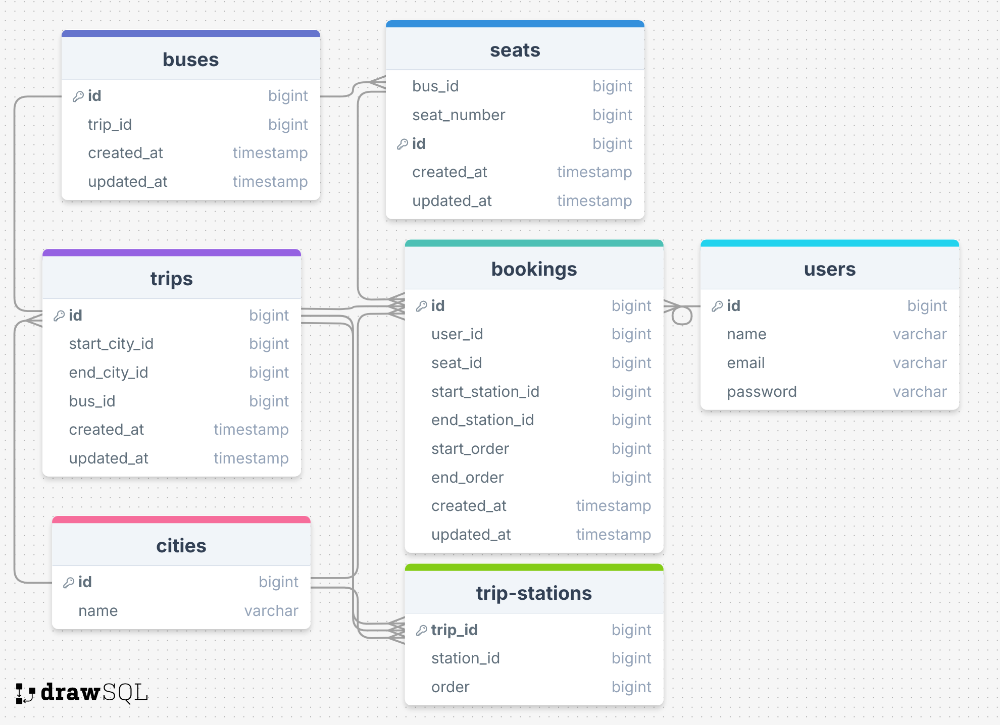

## Fleet Management System (Bus-Booking) 

A fleet-management system built with Laravel 11 that allows users to book bus seats for predefined trips with intermediate stations.

## Overview
This project is a **Laravel-based Fleet Management System** that allows users to book seats on predefined bus trips between Egyptian cities. The system ensures that seats are only booked if they are available for the selected trip segment.

## Features
- **Trip Management**: Predefined trips between cities with intermediate stations.
- **Seat Booking**: Users can book seats for specific trip segments (e.g., Cairo to AlFayyum).
- **Seat Availability**: Users can check available seats for a trip segment.
- **Validation**: Proper validation for user inputs and seat availability.
- **Authentication**: Secure user authentication for booking seats.
- **Database**: Relational database design with proper normalization.
- **APIs**: RESTful APIs for seat booking and availability checking.

## Prerequisites
Before you begin, ensure you have the following installed:
- **PHP** (version 8.0 or higher)
- **Composer** (for dependency management)
- **MySQL** (or any compatible database)
- **Git** (for cloning the repository)

## Installation

### 1. Clone the Repository
```bash
git clone https://github.com/mennaabdelelhady/SmartFleet.git
cd SmartFleet
```

### 2. Install Dependencies
Install PHP dependencies using Composer:
```bash
composer install
```

### 3. Set Up the Database
Create a new MySQL database for the project:
```sql
CREATE DATABASE smartfleet;
```

Import the database dump:
Locate the SQL file in the smart fleet.sql.
Import it into your database using a tool like phpMyAdmin or the MySQL command line:
```bash
mysql -u your_username -p smartfleet < database/smartfleet_dump.sql
```

### 4. Configure Environment Variables
Rename the `.env.example` file to `.env`:
```bash
cp .env.example .env
```

Update the `.env` file with your database credentials and other settings:
```env
DB_HOST=localhost
DB_PORT=3306
DB_DATABASE=smartfleet
DB_USERNAME=your_username
DB_PASSWORD=your_password
```

Generate an application key:
```bash
php artisan key:generate
```

### 5. Run Migrations and Seeders
Run the following commands to set up the database schema and seed initial data:
```bash
php artisan migrate
php artisan db:seed
```

### 6. Start the Development Server
Run the Laravel development server:
```bash
php artisan serve
```
The application will be accessible at [http://localhost:8000](http://localhost:8000).

### 7. Test the APIs
You can use tools like Postman or cURL to test the API endpoints. Below are the available APIs:

#### Get Available Seats
**Endpoint:** `GET /api/available-seats`

**Parameters:**
- `start_station`: ID of the starting station.
- `end_station`: ID of the destination station.

**Example:**
```bash
GET http://localhost:8000/api/available-seats?start_station=1&end_station=3
```

#### Book a Seat
**Endpoint:** `POST /api/book-seat`

**Parameters (JSON body):**
- `trip_id`: ID of the trip.
- `start_station`: ID of the starting station.
- `end_station`: ID of the destination station.
- `seat_id`: ID of the seat to book.

**Example:**
```bash
POST http://localhost:8000/api/book-seat
```
**Body (JSON):**
```json
{
  "trip_id": 1,
  "start_station": 1,
  "end_station": 3,
  "seat_id": 5
}
```

## Database Schema (ERD)
The database schema is designed to support the fleet management system. Below is the Entity-Relationship Diagram (ERD):

<p align="center">
  
</p>

## Special Configurations
- **Seat Availability Logic:** The system ensures that seats are only booked if they are available for the selected trip segment. If a bus is fully booked for a segment, users cannot book seats for overlapping segments.
- **Validation:** All user inputs are validated to prevent errors and ensure data integrity.
- **Authentication:** Users must authenticate to book seats. Laravel Sanctum can be used for API authentication.

## Project Structure
```
SmartFleet/
├── app/                # Application logic
│   ├── Models/         # Database models
│   ├── Http/           # Controllers and middleware
│   └── ...             # Other Laravel components
├── config/             # Configuration files
├── database/           # Database migrations, seeders, and dump
├── public/             # Publicly accessible files
├── routes/             # API and web routes
├── tests/              # Unit and feature tests
├── .env.example        # Environment variables template
├── composer.json       # Composer dependencies
└── README.md           # Project documentation
```

## Contributing
If you’d like to contribute to this project, please follow these steps:
1. Fork the repository.
2. Create a new branch for your feature or bug fix.
3. Submit a pull request with a detailed description of your changes.


<p align="center"><a href="https://laravel.com" target="_blank"></a></p>

<p align="center">
<a href="https://github.com/laravel/framework/actions"></a>
<a href="https://packagist.org/packages/laravel/framework"></a>
<a href="https://packagist.org/packages/laravel/framework"></a>
<a href="https://packagist.org/packages/laravel/framework"></a>
</p>

## About Laravel

Laravel is a web application framework with expressive, elegant syntax. We believe development must be an enjoyable and creative experience to be truly fulfilling. Laravel takes the pain out of development by easing common tasks used in many web projects, such as:

- [Simple, fast routing engine](https://laravel.com/docs/routing).
- [Powerful dependency injection container](https://laravel.com/docs/container).
- Multiple back-ends for [session](https://laravel.com/docs/session) and [cache](https://laravel.com/docs/cache) storage.
- Expressive, intuitive [database ORM](https://laravel.com/docs/eloquent).
- Database agnostic [schema migrations](https://laravel.com/docs/migrations).
- [Robust background job processing](https://laravel.com/docs/queues).
- [Real-time event broadcasting](https://laravel.com/docs/broadcasting).

Laravel is accessible, powerful, and provides tools required for large, robust applications.

## Learning Laravel

Laravel has the most extensive and thorough [documentation](https://laravel.com/docs) and video tutorial library of all modern web application frameworks, making it a breeze to get started with the framework.

You may also try the [Laravel Bootcamp](https://bootcamp.laravel.com), where you will be guided through building a modern Laravel application from scratch.

If you don't feel like reading, [Laracasts](https://laracasts.com) can help. Laracasts contains thousands of video tutorials on a range of topics including Laravel, modern PHP, unit testing, and JavaScript. Boost your skills by digging into our comprehensive video library.

## Laravel Sponsors

We would like to extend our thanks to the following sponsors for funding Laravel development. If you are interested in becoming a sponsor, please visit the [Laravel Partners program](https://partners.laravel.com).

### Premium Partners

- **[Vehikl](https://vehikl.com/)**
- **[Tighten Co.](https://tighten.co)**
- **[WebReinvent](https://webreinvent.com/)**
- **[Kirschbaum Development Group](https://kirschbaumdevelopment.com)**
- **[64 Robots](https://64robots.com)**
- **[Curotec](https://www.curotec.com/services/technologies/laravel/)**
- **[Cyber-Duck](https://cyber-duck.co.uk)**
- **[DevSquad](https://devsquad.com/hire-laravel-developers)**
- **[Jump24](https://jump24.co.uk)**
- **[Redberry](https://redberry.international/laravel/)**
- **[Active Logic](https://activelogic.com)**
- **[byte5](https://byte5.de)**
- **[OP.GG](https://op.gg)**

## Contributing

Thank you for considering contributing to the Laravel framework! The contribution guide can be found in the [Laravel documentation](https://laravel.com/docs/contributions).

## Code of Conduct

In order to ensure that the Laravel community is welcoming to all, please review and abide by the [Code of Conduct](https://laravel.com/docs/contributions#code-of-conduct).

## Security Vulnerabilities

If you discover a security vulnerability within Laravel, please send an e-mail to Taylor Otwell via [taylor@laravel.com](mailto:taylor@laravel.com). All security vulnerabilities will be promptly addressed.

## License

The Laravel framework is open-sourced software licensed under the [MIT license](https://opensource.org/licenses/MIT).
